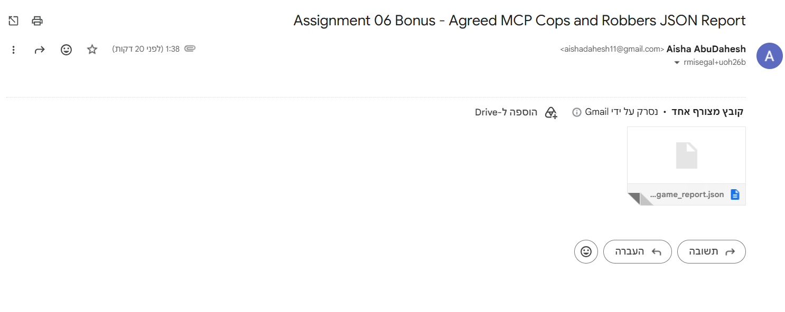

# ShadowGrid: Agent Chase Protocol

ShadowGrid is a multi-agent cops-and-robber orchestration project built for the University of Haifa
AI Agents Orchestration assignment. It demonstrates two independent roles, a cop and a robber,
operating in a partially observable grid world. Agents communicate through natural-language
messages, infer opponent state from limited observations, translate decisions into physical moves,
and produce the required InternalGameJSON report.

The current implementation is a complete submission package: playable GUI, saved game replay export,
movement JSON export, MCP server entry points, Gemini/OpenAI API support, deterministic fallback
agents, legality guards for AI actions, verified tests, lint-clean source code, professional
submission documentation, and an ngrok-ready inter-group bonus runner.

The project is written as a scientific report as well as runnable software. It documents the
formal Dec-POMDP model, orchestration tradeoffs, visual evidence, bonus scoring, and the exact JSON
artifacts used for evaluation.

## Project Goals

- Demonstrate agent orchestration, not only game strategy.
- Separate game rules, agent reasoning, MCP tool exposure, reporting, GUI, and replay export.
- Support local execution without API keys, while allowing Gemini/OpenAI-backed agents when keys
  exist.
- Produce concrete evidence artifacts: JSON report, saved game video, and movement log.
- Match the assignment's local requirements and support the inter-group ngrok/cloud bonus flow.

## Main Features

- Configurable grid, defaulting to 5x5.
- Six-sub-game CLI series with assignment scoring.
- Robber moves first, then cop.
- Eight-direction movement. `stay` is intentionally rejected by the action legality policy.
- Cop barrier placement, up to five barriers per sub-game.
- Partial observation through configurable visibility radius.
- Natural-language messages between agents.
- Shared action validation for CLI, MCP, and GUI execution paths.
- Separate MCP server modules for cop and robber.
- Ngrok-ready bonus mode with token-protected public MCP URLs and bonus JSON output.
- Gemini and OpenAI provider support with deterministic fallback.
- Centered GUI with four play modes:
  - Cop agent, robber user
  - Cop user, robber agent
  - Cop user, robber user
  - Cop OpenAI, robber Gemini
- Click-to-move on highlighted legal squares.
- Start curtain showing game start and player matchup.
- End overlay showing the winner.
- Timestamped `Save Game` export after game completion.

## Quick Start

From the repository root:

```powershell
python -m venv .venv
.\.venv\Scripts\Activate.ps1
pip install -e ".[dev,email]"
```

On systems where `python` is not available but the Windows launcher is installed:

```powershell
py -m venv .venv
.\.venv\Scripts\Activate.ps1
pip install -e ".[dev,email]"
```

Optional API keys:

```powershell
Copy-Item .env.example .env
notepad .env
```

`.env` format:

```env
GEMINI_API_KEY=your-gemini-key
OPENAI_API_KEY=your-openai-key
```

If API keys are missing, the project uses deterministic fallback agents so the game still runs.

## Running The CLI Series

```powershell
.\scripts\run_local.ps1
```

This runs the full six-sub-game local series and writes:

```text
reports/internal_game_report.json
```

The report contains group metadata, students, GitHub URL, MCP URLs, timezone, all sub-games, move
traces, scores, and totals.

## Running The Ngrok Bonus Series

Start the two local HTTP MCP servers and ngrok tunnels using the steps in
[`docs/CLOUD_BONUS.md`](docs/CLOUD_BONUS.md). After exchanging URLs and tokens with the other group,
copy and edit the bonus config:

```powershell
Copy-Item bonus_config.example.json bonus_config.json
python -m cops_robbers_ai.cli --bonus-config bonus_config.json --print-report
```

This writes:

```text
reports/bonus_game_report.json
```

When `bonus_config.json` has `email.enabled=true`, the same command also sends two official
confirmation emails to `rmisegal+uoh26b@gmail.com`: one authenticated as group 1 and one
authenticated as group 2. Each email attaches only the generated `bonus_game_report.json`, so both
groups submit the exact same agreed JSON evidence.

## Running The GUI

```powershell
.\scripts\run_gui.ps1
```

GUI controls:

- Click highlighted green squares to move.
- Use `QWE / AD / ZXC` for keyboard movement.
- Use `B` or right-click for cop barrier placement.
- Click `New Game` to restart.
- Click `Save Game` after the game ends.

## Results And Evidence

The project produces concrete evidence artifacts in `reports/`. These are intentionally kept as
submission material: the evaluator can inspect the six-sub-game JSON, watch saved GUI replays, and
cross-check each replay against its movement log.

| Artifact | Path | Description |
| --- | --- | --- |
| Internal game report | [`reports/internal_game_report.json`](reports/internal_game_report.json) | Required assignment JSON for the six-sub-game series |
| Bonus game report | [`reports/bonus_game_report.json`](reports/bonus_game_report.json) | Inter-group bonus report with six autonomous remote MCP games |
| Reports index | [`reports/README.md`](reports/README.md) | Human-readable catalog of saved reports, videos, and movement logs |
| Current implementation audit | [`docs/CURRENT_IMPLEMENTATION.md`](docs/CURRENT_IMPLEMENTATION.md) | Snapshot of what is implemented, verified, and still deferred |
| Assignment compliance review | [`docs/ASSIGNMENT_REVIEW.md`](docs/ASSIGNMENT_REVIEW.md) | Mapping from reference PDF requirements to implementation status |

Current CLI result:

| Metric | Value |
| --- | --- |
| Generated at | `2026-06-26T01:46:06.327007+03:00` |
| Sub-games | `6` |
| Results | `6 cop wins, 0 robber wins` |
| Totals | `cop=120`, `thief=30` |
| Validation | no `stay` moves, no robber barriers, no sub-game above 25 move pairs |

Current bonus result:

| Metric | Value |
| --- | --- |
| Generated at | `2026-06-26T01:38:11.804738+03:00` |
| Partner group | `yanell11` |
| Sub-games | `6` |
| Win count | `uoh-ay26=5`, `yanell11=1` |
| Score totals | `uoh-ay26=85`, `yanell11=45` |
| Bonus claim | `uoh-ay26=10`, `yanell11=7` |
| Agreement | `mutual_agreement=true`; matching JSON emailed from both group accounts |

### Email Evidence

The bonus report email was sent with the subject required for the assignment and the JSON report
attached. The screenshot below is included as lightweight proof of the Gmail delivery flow:



## Self-Scoring

This section states our own scoring claim for the base assignment out of 100, plus the separate
bonus claim.

| Area | Evidence | Points |
| --- | --- | ---: |
| Game rules and configuration | 5x5 grid, 25 max move pairs, 6 games, 5 barriers, official scoring in `config.json` | 15/15 |
| Agent orchestration | thief-first turn order, two roles, message passing, legality guard, no final `stay` actions | 18/20 |
| MCP architecture | separate cop/thief MCP servers, client-side orchestrator, remote state synchronization | 15/15 |
| Scientific README/reporting | Dec-POMDP tuple, orchestration analysis, strategy discussion, results, tools, challenges | 18/20 |
| Evidence and visualization | GUI, MP4/GIF replay previews, movement JSON logs, report index | 14/15 |
| Testing and engineering quality | 13 tests passing, Ruff clean, all `.py` files at or below 150 lines, secrets ignored | 13/15 |
| **Total base assignment score claim** | Complete required assignment package with modest room left for evaluator judgment | **93/100** |

Separate bonus claim: `uoh-ay26` won the inter-group bonus series against `yanell11` with score
`85-45` and win count `5-1`, so we claim the winner-side bonus value of `10` points. The partner
group receives `7` points according to the agreed report.

### Visual Replay Gallery

These GIF previews are generated from the saved MP4 files so the replay evidence is visible directly
inside GitHub's README view. The MP4 files are still kept as the full video artifacts.

| Preview | Full Video | Movement JSON |
| --- | --- | --- |
|  | [`MP4`](reports/shadowgrid_replay_20260622_230818.mp4) | [`JSON`](reports/shadowgrid_replay_20260622_230818_movements.json) |
|  | [`MP4`](reports/shadowgrid_replay_20260622_230957.mp4) | [`JSON`](reports/shadowgrid_replay_20260622_230957_movements.json) |
|  | [`MP4`](reports/shadowgrid_replay_20260622_231534.mp4) | [`JSON`](reports/shadowgrid_replay_20260622_231534_movements.json) |
|  | [`MP4`](reports/shadowgrid_replay_20260622_231701.mp4) | [`JSON`](reports/shadowgrid_replay_20260622_231701_movements.json) |
|  | [`MP4`](reports/shadowgrid_replay_20260624_134355.mp4) | [`JSON`](reports/shadowgrid_replay_20260624_134355_movements.json) |
|  | [`MP4`](reports/shadowgrid_replay_20260624_134450.mp4) | [`JSON`](reports/shadowgrid_replay_20260624_134450_movements.json) |
|  | [`MP4`](reports/shadowgrid_replay_20260624_134504.mp4) | [`JSON`](reports/shadowgrid_replay_20260624_134504_movements.json) |

Saved GUI replay evidence:

| Video | Movement JSON | Mode | Result | Moves |
| --- | --- | --- | --- | --- |
| [`shadowgrid_replay_20260622_230818.mp4`](reports/shadowgrid_replay_20260622_230818.mp4) | [`shadowgrid_replay_20260622_230818_movements.json`](reports/shadowgrid_replay_20260622_230818_movements.json) | Cop agent, robber user | Cop wins | 6 |
| [`shadowgrid_replay_20260622_230957.mp4`](reports/shadowgrid_replay_20260622_230957.mp4) | [`shadowgrid_replay_20260622_230957_movements.json`](reports/shadowgrid_replay_20260622_230957_movements.json) | Cop OpenAI, robber Gemini | Robber wins | 50 |
| [`shadowgrid_replay_20260622_231534.mp4`](reports/shadowgrid_replay_20260622_231534.mp4) | [`shadowgrid_replay_20260622_231534_movements.json`](reports/shadowgrid_replay_20260622_231534_movements.json) | Cop OpenAI, robber Gemini | Cop wins | 6 |
| [`shadowgrid_replay_20260622_231701.mp4`](reports/shadowgrid_replay_20260622_231701.mp4) | [`shadowgrid_replay_20260622_231701_movements.json`](reports/shadowgrid_replay_20260622_231701_movements.json) | Cop agent, robber user | Robber wins | 50 |
| [`shadowgrid_replay_20260624_134355.mp4`](reports/shadowgrid_replay_20260624_134355.mp4) | [`shadowgrid_replay_20260624_134355_movements.json`](reports/shadowgrid_replay_20260624_134355_movements.json) | Cop OpenAI, robber Gemini | Cop wins | 6 |
| [`shadowgrid_replay_20260624_134450.mp4`](reports/shadowgrid_replay_20260624_134450.mp4) | [`shadowgrid_replay_20260624_134450_movements.json`](reports/shadowgrid_replay_20260624_134450_movements.json) | Cop agent, robber user | Cop wins | 14 |
| [`shadowgrid_replay_20260624_134504.mp4`](reports/shadowgrid_replay_20260624_134504.mp4) | [`shadowgrid_replay_20260624_134504_movements.json`](reports/shadowgrid_replay_20260624_134504_movements.json) | Cop user, robber agent | Cop wins | 6 |

The saved replay includes the start presentation, player matchup, board states, and final winner
frame. The movement JSON allows the replay to be audited programmatically. Future GUI saves create
both the MP4 replay and a matching `_readme.gif` preview.

## Architecture

ShadowGrid is split into focused modules:

- `engine.py`: grid rules, movement, barriers, capture, scoring.
- `models.py`: shared domain types such as `Position`, `Move`, `Action`, and `GameState`.
- `action_policy.py`: legality guard that converts invalid agent choices into valid movement.
- `strategy.py`: deterministic fallback agent behavior and natural-language hint parsing.
- `llm_agent.py`: Gemini/OpenAI provider calls with fallback behavior.
- `orchestrator.py`: local six-sub-game series runner.
- `orchestrator_source.txt`: remote and bonus orchestration implementation loaded by the compact
  orchestrator module.
- `mcp_common.py`: compact FastMCP server construction and run helper.
- `mcp_agent_state.py`: MCP server-side role state and action decisions.
- `mcp_auth.py`: static bearer-token verifier used by public bonus endpoints.
- `cop_server.py` and `thief_server.py`: separate MCP server entry points.
- `reporting.py`: InternalGameJSON creation and report writing.
- `gmail_client.py`: optional Gmail JSON sender.
- `gui.py`: playable GUI and replay capture.
- `gui_source.txt`: rich Tkinter GUI implementation loaded by the compact GUI module.
- `video_export.py`: compact replay-export module loader.
- `video_export_source.txt`: MP4 replay rendering plus README GIF preview rendering.

## Scientific README Requirements

The assignment asks for a scientific README with a formal model, orchestration analysis, and
visual/log evidence. This section maps the implementation to those requirements.

### Formal Model

The pursuit game is modeled as a partially observable decentralized decision process:

```text
<n, S, {A_i}, P, R, {Omega_i}, O, gamma>
```

- `n`: two agents, cop and robber.
- `S`: full board state: cop position, robber position, barriers, remaining barriers, and turn
  index.
- `{A_i}`: eight movement actions for both roles; barrier action for the cop. `stay` exists only as
  a defensive internal value and is sanitized away before valid turns are recorded.
- `P`: deterministic transition function constrained by grid bounds and barriers.
- `R`: assignment scoring table.
- `{Omega_i}`: partial observations available to each role.
- `O`: observation function implemented by `GameState.visible_to`.
- `gamma`: reserved for future reinforcement-learning extensions.

In code, `S` is represented by `GameState`, `P` by `GameEngine.apply`, `R` by
`GameEngine.score`, and `O` by `GameState.visible_to`. The orchestrator is the authority for state
transitions, which prevents remote agents from silently changing the board.

### Orchestration Analysis

The difficult part of the assignment is not simply catching the robber; it is coordinating
independent agents without a brittle hard-coded dialogue protocol. ShadowGrid handles this through
three layers:

- **Natural-language messages:** agents send short free-text hints and intent statements.
- **Structured state synchronization:** remote MCP agents receive exact board state through
  `update_state`, so natural language can stay conversational rather than carrying all state.
- **Legality guard:** `action_policy.sanitize_action` converts invalid model choices into legal
  role-aware actions, preventing malformed LLM output from corrupting the report.

This design keeps LLM reasoning on the client/orchestration side while the MCP servers expose
tools, matching the assignment's client/server separation.

### Strategy And Q-Table Decision

The assignment allows heuristic strategy or Q-table style learning. This implementation uses a
deterministic heuristic plus optional Gemini/OpenAI reasoning rather than a trained Q-table. The
reason is practical and scientific: the project goal is to prove reliable orchestration,
partial-observation handling, MCP communication, and report integrity. The heuristic is transparent:

- the cop moves toward the inferred or visible robber and may place barriers;
- the robber maximizes distance and prefers safer edge/corner movement;
- the LLM provider can override with natural-language reasoning, but final actions are sanitized.

`gamma` remains in the formal model as the discount factor for a future Q-learning extension.

### Visualization And Logs

Evidence is intentionally redundant:

- GUI videos show the board, start curtain, movement, barriers, and winner frame.
- README GIF previews make saved games visible inside GitHub.
- movement JSON files record every GUI move, message, actor type, and board state.
- `internal_game_report.json` records the required local series.
- `bonus_game_report.json` records the six-game cloud/remote MCP series.
- tests and lint provide executable engineering evidence.

## MCP Design

The project follows the assignment distinction between MCP server and MCP client:

- MCP servers expose tools.
- The orchestrator/client manages the dialogue, LLM calls, and turn sequence.
- LLMs are not embedded as long-running server state.

Available MCP tools:

- `reset_game`
- `receive_message`
- `choose_action`

Run the servers in separate terminals:

```powershell
$env:PYTHONPATH="src"; python -m cops_robbers_ai.cop_server
```

```powershell
$env:PYTHONPATH="src"; python -m cops_robbers_ai.thief_server
```

## Tools And Technologies Used

- Python 3.11+
- FastMCP / MCP Python package
- Tkinter for GUI
- Gemini API through `google-genai`
- OpenAI API through `openai`
- Pillow and ImageIO for replay rendering
- Google API client libraries for optional Gmail delivery
- Pytest for tests
- Ruff for linting
- pypdf for assignment PDF review/extraction
- JSON configuration and `.env` secret management

## Challenges And Decisions

**Partial observability:** Agents cannot always see the opponent. The project handles this through a
visibility radius and natural-language hints.

**Provider reliability:** API keys, quotas, and network availability can fail. The system therefore
includes deterministic fallback agents.

**Action legality:** LLMs can ask for impossible moves. The shared action policy makes sure reports
contain valid assignment actions.

**MCP/client separation:** The assignment requires MCP servers to expose tools while the
client/orchestrator owns reasoning. The code keeps this separation.

**GUI replay evidence:** A normal GUI is hard to submit as evidence. The replay exporter creates a
video/GIF and a movement JSON log.

**Windows timezone support:** `Asia/Jerusalem` requires `tzdata` in some Windows/Python
environments, so it is included as a dependency.

**Video encoding portability:** MP4 export may fail on some systems. The exporter falls back to GIF.

## Documentation Map

- `docs/CURRENT_IMPLEMENTATION.md`: verified implementation snapshot.
- `docs/PRD.md`: product requirements and acceptance criteria.
- `docs/PRD_GAME_ENGINE.md`: game-engine-specific requirements.
- `docs/PRD_AGENT_ORCHESTRATION.md`: agent/MCP/provider requirements.
- `docs/PRD_GUI_REPLAY.md`: GUI and replay-export requirements.
- `docs/PLAN.md`: staged implementation plan.
- `docs/REQUIREMENTS.md`: assignment and runtime requirements.
- `docs/ARCHITECTURE.md`: system architecture and Dec-POMDP explanation.
- `docs/RUNBOOK.md`: setup, running, MCP, GUI, and Gmail instructions.
- `docs/ASSIGNMENT_REVIEW.md`: reference-PDF compliance review.
- `docs/PROMPT_LOG.md`: AI-assisted development prompt log.
- `docs/TODO.md`: 900-item professional backlog.
- `reports/README.md`: generated evidence index.

## Testing

```powershell
.\.venv\Scripts\python.exe -m pytest
.\.venv\Scripts\python.exe -m ruff check src tests
```

Verified checks:

- Capture behavior.
- Barrier blocking.
- Report shape.
- Agent action sanitization.
- No-stay fallback behavior.
- GUI and video exporter imports.
- All Python source files are at or below 150 lines; larger GUI/replay/orchestration
  implementations are packaged as source text assets and loaded by compact modules.
- Ruff linting across `src` and `tests`.

## Gmail Report Delivery

Gmail sending is disabled by default. To enable:

1. Follow `ref/main-google-api-installtion-guid.pdf`.
2. Place `credentials.json` in the repository root.
3. Set `email.enabled` to `true` in `config.json`.
4. Run the local series.

The email body is JSON only, matching the assignment's automated-processing requirement.

For the bonus flow, email settings live in `bonus_config.json`. The configured subject is:

```text
Assignment 06 Bonus - Agreed MCP Cops and Robbers JSON Report
```

The current bonus configuration sends the final JSON attachment from:

- `aishadahesh11@gmail.com` using `token_group_1_aisha.json`
- `yanalserhan3@gmail.com` using `token_group_2_yanal.json`

Place `credentials.json` in the repository root before running the bonus command. On the first run,
Gmail OAuth opens a browser approval flow for each sender token file. After those token files exist,
future bonus runs send the two emails automatically at the end.
