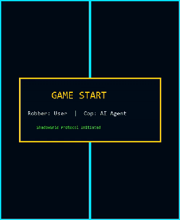
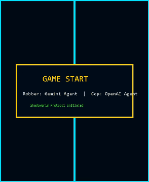
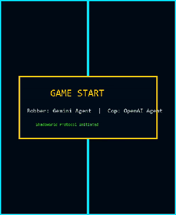
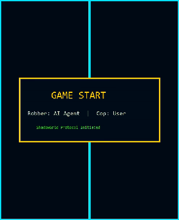

# ShadowGrid Reports And Replay Evidence

This folder contains the evidence generated by the current ShadowGrid implementation.

## Current InternalGameJSON

| File | Purpose | Current Result |
| --- | --- | --- |
| [`internal_game_report.json`](internal_game_report.json) | Required six-sub-game assignment report | 6 sub-games, totals `cop=120`, `thief=30` |

The latest report was generated at `2026-06-24T13:10:37.050200+03:00`. The run contains no final
`stay` actions, no robber barrier actions, and no sub-game above the configured 25 move-pair limit.

## Saved GUI Replays

Each saved GUI game produces three evidence files:

- an MP4 replay;
- a matching movement JSON file with every move, actor type, message, state snapshot, result, and
  replay path.
- a lightweight `_readme.gif` preview generated from the MP4 so the replay is visible in GitHub.

| GIF Preview | Video | Movement JSON | Mode | Result | Moves |
| --- | --- | --- | --- | --- | --- |
|  | [`MP4`](shadowgrid_replay_20260622_230818.mp4) | [`JSON`](shadowgrid_replay_20260622_230818_movements.json) | Cop agent, robber user | Cop wins | 6 |
|  | [`MP4`](shadowgrid_replay_20260622_230957.mp4) | [`JSON`](shadowgrid_replay_20260622_230957_movements.json) | Cop OpenAI, robber Gemini | Robber wins | 50 |
|  | [`MP4`](shadowgrid_replay_20260622_231534.mp4) | [`JSON`](shadowgrid_replay_20260622_231534_movements.json) | Cop OpenAI, robber Gemini | Cop wins | 6 |
|  | [`MP4`](shadowgrid_replay_20260622_231701.mp4) | [`JSON`](shadowgrid_replay_20260622_231701_movements.json) | Cop agent, robber user | Robber wins | 50 |
|  | [`MP4`](shadowgrid_replay_20260624_134355.mp4) | [`JSON`](shadowgrid_replay_20260624_134355_movements.json) | Cop OpenAI, robber Gemini | Cop wins | 6 |
|  | [`MP4`](shadowgrid_replay_20260624_134450.mp4) | [`JSON`](shadowgrid_replay_20260624_134450_movements.json) | Cop agent, robber user | Cop wins | 14 |
|  | [`MP4`](shadowgrid_replay_20260624_134504.mp4) | [`JSON`](shadowgrid_replay_20260624_134504_movements.json) | Cop user, robber agent | Cop wins | 6 |

## How To Regenerate Evidence

Run the local six-sub-game series:

```powershell
.\scripts\run_local.ps1
```

Play a GUI game and export replay evidence:

```powershell
.\scripts\run_gui.ps1
```

After the GUI game ends, click `Save Game`. New files are timestamped, so previous videos and JSON
logs are preserved. The save flow keeps the MP4 replay and also writes a `_readme.gif` preview for
documentation.
